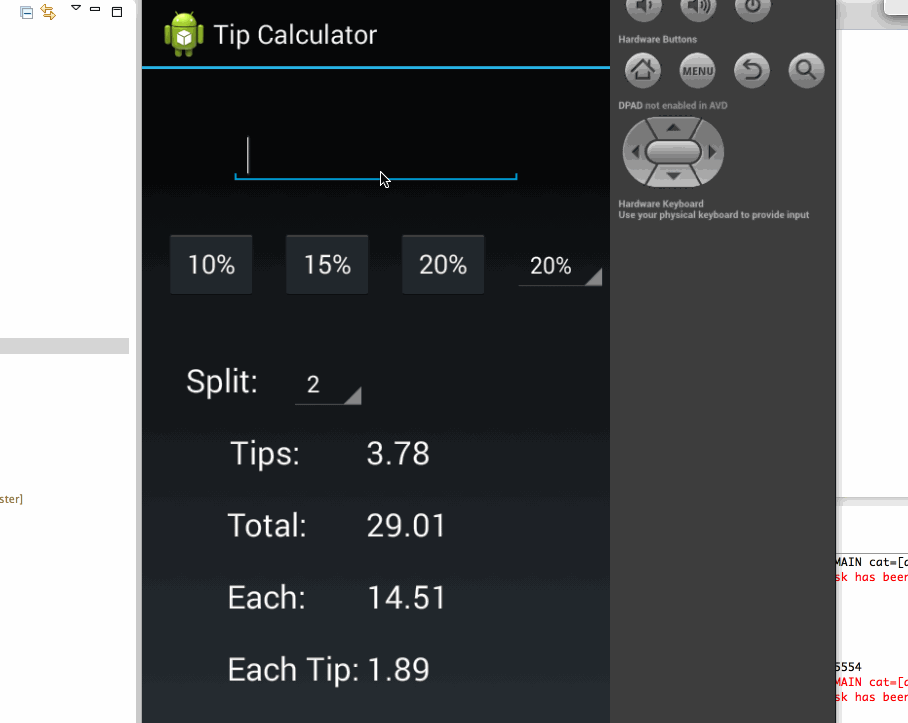

Tip-Calculate
=============
#### Time spent: 4 hours in total

#### Completed user stories:

 * [x] Require: User is displayed the tip of specified percentage for specified entered amount
 * [x] Require: User enters the total amount of the transaction
 * [x] Require: User can select between tip amounts (i.e 10%, 15%, 20%)
 * [x] Require: Upon selecting tip amount, formatted tip value is displayed
 * [x] Optional: User can select custom tip percentage if desired

#### Walkthrough of all user stories:

 
